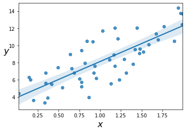

# Jupyter notebook test file

Welcome to the first jupyter notebook. This is a test file to verify your installation of python.

If you have never heard about or used jupyter notebooks before, don't worry! Jupyter notebooks provide an easy way to combine formatted text (such as this paragraph) with python code (such as the box below). The great thing is that you can also execute the python code live on this page. Try it out by clicking on the `Run` button in the toolbar above.

On the first click, the blue box around the headline probably jumped to the next paragraph, but nothing else happened, right? This is how jupyter notebooks operate: the formatted text blocks and the code blocks are organised in _cells_ – each of which can be executed. Now, executing a cell with only text doesn't do anything of course ... But with every click on `Run`, you run the active (blue) cell and jump to the next one. If this paragraph is currently marked in blue, click on `Run` twice, to execute both this cell with formatted text, and the cell with python code below.


```python
import sys
sys.version
```


    '3.8.8 | packaged by conda-forge | (default, Feb 20 2021, 15:50:57) \n[Clang 11.0.1 ]'


Great, you've executed your first bit of python code! Python is an extremely _modular_ language, meaning that it is organised in chunks of code called _modules_. These modules provide all sorts of functionalities, usually dedicated to specific tasks. For example, the module collection [numpy](https://www.numpy.org/) provides functionality for numerical computations. It is one of the most widely used collections in scientific programming. By the way, collections of modules are called `packages`.

The above two commands import one module called `sys`, which provides some functions to learn about the python installation itself. The command `sys.version` for example tells you the version of python that you are running on. Hopefully, the output says something like:
```
Python version: 3.8.8 (some more info ...)
```
which is the python version that we would like to use for these tutorials. 

### Installation of basic packages

Click on the `Run` button again to jump to the cell of python code below and execute it.


```python
import numpy as np
np.__version__
```


    '1.19.5'


```python
import matplotlib as mpl
import matplotlib.pyplot as plt
mpl.__version__
```


    '3.3.4'


As you might have guessed, the two `import` lines above load two more modules: the numpy package for scientific programming, and [matplotlib](https://matplotlib.org), a package for visualising data. Two more gimmicks:
- the `import` command can also creates aliases for modules/packages with the `as` keyword. This can be useful if the names of modules/packages are very long. In the above example, anything within `matplotlib` can be accessed with the alias `mpl`. 
- You can also import only _parts_ of a package. Many packages have functionalities bundled in their own small modules. In the above example, the `matplotlib.pyplot` module is imported separately from `matplotlib` and is given the alias `plt`.

If your python installation was done correctly, you should get version numbers like these:
```
Numpy version:      1.19.5
Matplotlib version: 3.3.4
```
The patch version (which is the number after the second dot) might be different, but the major and minor version number should be identical. 

Usually, this should be enough to verify the installation. But let's run the following piece of code, which uses these two packages to create some random data, perform a polynomial regression, and plot the result:


```python
import seaborn as sns

# Generate 50 random x values in the interval [0, 2].
# For each of these random values, generate a y value
# following the formula y = 3 + 4x. To make our data
# more interesting, we add some random noise.
m = 50
X = 2 * np.random.rand(m)
y = 3 + 5 * X + 2 * np.random.randn(m)

# Add some labels to the axes before plotting.
plt.xlabel("$x$", fontsize=18)
plt.ylabel("$y$", rotation=0, fontsize=18)

# Now, import the seaborn package, another library for
# data visualisation (built on top of matplotlib). Use
# seaborn to perform a linear regression and plot it.

sns.regplot(x=X, y=y)
```


    <AxesSubplot:xlabel='$x$', ylabel='$y$'>


    

    


Hopefully this worked, too. By the way, you can always click on the code and start to modify it! For example, try to change the value of `m` in the above cell, and then run the cell again. Does the plot look different?

Another thing: you can always jump back in forth within a notebook by using your up/down arrow keys or simply clicking on the cells. Sometimes it is useful to reset the jupyter notebook and start from scratch. This will remove all generated output and only leave the formatted text and code cells. To do this, click on the `Kernel` drop-down menu and click on `Restart & Clear Output`. The kernel restart means that python will also "forget" about anything you did: variables you assigned, modules you imported etc.

### Machine-learning libraries

Before we finish, let's make sure our machine-learning packages have the correct version as well. Execute the following code cell to import [Scikit-Learn](https://scikit-learn.org/) and [tensorflow](https://www.tensorflow.org/) and check their versions:


```python
import sklearn as skl
skl.__version__
```


    '0.24.2'


```python
import tensorflow as tf
tf.__version__
```


    '2.4.1'


If everything is set up correctly, the versions should be:
```
scikit-learn version: 0.24.2
tensorflow version:   2.4.1
```

Hurray, the setup was successful!
