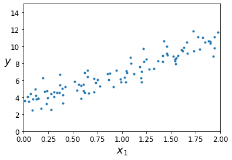
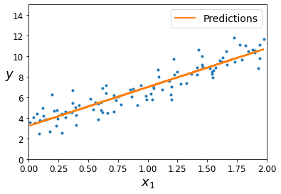
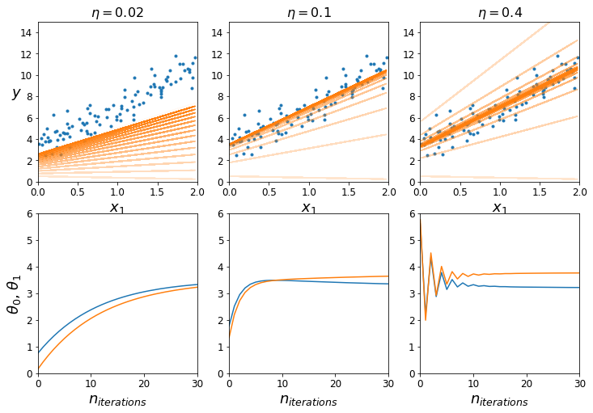

# Basics, algorithms

Welcome to the first jupyter notebook! In this session, we won't go into too many minute details yet, but will cover the basics of machine learning. We've tried to keep it as simple as possible, also because many might only have little experience with python and/or programming a 'learning machine'. If it looks like you're gonna be through the content of this notebook in ten minutes or so, because you're already familiar with all of its concepts, then feel free to challenge yourself a little more by making your own adjustments to the code, diving deeper into advanced topics or doing some last-minute preparations for your group presentations.

## Setup

To allow the next code blocks to run smoothly, this section sets a couple of settings.

Some imports that we will be using:


```python
import numpy as np
import matplotlib as mpl
import matplotlib.pyplot as plt
```

Set the random seed to a fixed number. This will guarantee that the notebook output is generated the same way for every run, otherwise the seed would be – random, as the name suggests.


```python
np.random.seed(42)
```

Set the numpy output precision for some prettier numbers:


```python
np.set_printoptions(precision=3, suppress=True)
```

Some figure plotting settings: increase the axis labels of our figures a bit.


```python
mpl.rc('axes', labelsize=14)
mpl.rc('xtick', labelsize=12)
mpl.rc('ytick', labelsize=12)
```

## Linear regression with the normal equation

Let's start with something simple: linear regression. As we've learnt before, we can use the _normal equation_ to calculate a prediction. In statistics, we usually label this as $\hat{\theta}$, because it is an estimator for the parameter vector $\theta$ of the model. The hat indicates that it's an estimator.

 First we need to generate some random data.


```python
m = 100   # number of data points
X = 2 * np.random.rand(m, 1)
y = 3 + 4 * X + np.random.randn(m, 1)
```

And let's plot it to get an idea what we're looking at. Of course, we do things the proper way, and put labels on our axes!


```python
plt.plot(X, y, ".")
plt.xlabel("$x_1$", fontsize=18)
plt.ylabel("$y$", rotation=0, fontsize=18)
plt.axis([0, 2, 0, 15])
plt.show()
```


    

    


We can also print a few of the generated data values, just to get an idea what we're talking about. The following command shows us the first three entries of the object `X` that we just generated:


```python
X[0:3]
```


    array([[0.749],
           [1.901],
           [1.464]])


And this shows us the first three corresponding entries in the object `y`:


```python
y[0:3]
```


    array([[ 6.083],
           [10.307],
           [ 8.948]])


Looks good. Reminder: what is the normal equation? And what are `X` and `y`?

$$ \hat{\theta} = \left( \mathbf{X}^T \cdot \mathbf{X} \right)^{-1} \cdot \mathbf{X}^T \cdot \mathbf{y} $$

Quick refresher if your mathematics is a littley rusty:
* $\hat{\theta}$ is our estimator for the vector of parameter $\theta$. This is what we want to calculate!
* $\mathbf{x}^{(i)}$, beware that it's lower-case, is a vector which contains all features of the training instance with index i. In the data generated above, we only have one 'feature', which is called $x_1$. So, $\mathbf{x}^{(0)}$, the feature vector of instance number zero, includes one single value: the value of $x_1$ for that instance, as printed out with the commands above.
* $\mathbf{X}$, now it's upper-case, is a vector of _all feature vectors_ $\mathbf{x}^{(i)}$. To make things more confusing, the entries of $\mathbf{X}$ are actually not $\mathbf{x}^{(i)}$, but the transposed vectors $(\mathbf{x}^{(i)})^T$.
* $\mathbf{y}$ are the _true_ target values of the instances. So, this is also a vector with the same dimension as $\mathbf{X}$. But even in more complicated input data structures, every entry of the target vector will just be the one target value.

Now, what can we do with the normal equation? And what _is_ actually this $\theta$? It's our vector of model parameters. The above case is very simple: we would like to create a model that represents the data as well as possible. With just looking at the plot, and without too much thinking, it's obvious that there is some sort of linear dependence between $x_1$ and $y$.

How many parameters do we need to describe this model? Probably two: one for the linear dependence, and one _bias term_ to shift the entire model along the y axis. So, our $\theta$ in this case is just a vector of two entries, and the goal of 'linear regression' is to find the optimal values of the two. And actually, if you scroll back up for a bit, you can already see the linear dependence, when we generated the data:

$$ y(x_1) = 3 + 4 \cdot x_1 $$

But let's pretend we don't know that ... Without using any machine learning yet, we can just use the above normal equation to get estimators for the two values. For that, we can make use of numpy's `linalg.inv()` function to invert matrices. Essentially, we then just need to 'type' the above formula into python and let our computer do the rest. Easy, right?

One more step is necessary: we need to append an additional feature $x_0 = 1$ to all instances, because otherwise we would ignore the bias parameter in our calculation:


```python
X_b = np.c_[np.ones((m, 1)), X]
```

Cool. Now, here's the typed-out formula for calculating the normal equation. It only uses numpy functions, such as the matrix inversion, or the calculation of dot products:


```python
theta = np.linalg.inv(X_b.T.dot(X_b)).dot(X_b.T).dot(y)
```

How do we know it worked? One easy thing is to check what the values of the two parameters are:


```python
print("theta_0 = %.3f" % theta[0][0])
print("theta_1 = %.3f" % theta[1][0])
```

    theta_0 = 3.215
    theta_1 = 3.770


Ok, that's not perfect, but close. Where does the difference come from? Probably from the fact that our data 'only' consists of 100 data points. the more data points we use, the closer we get to the values that we used to generate the data with.

Maybe it is also useful to plot the prediction as a line into the plot. For that, we should first calculate the predictions for the value of `y` for all our instances:


```python
y_predict = X_b.dot(theta)
```

And now we can do the plotting:


```python
plt.plot(X, y, ".")
plt.plot(X, y_predict, "-", linewidth=2, label="Predictions")
plt.xlabel("$x_1$", fontsize=18)
plt.ylabel("$y$", rotation=0, fontsize=18)
plt.legend(loc="upper right", fontsize=14)
plt.axis([0, 2, 0, 15])
plt.show()
```


    

    


Great! As a quick summary: we generated random data in python, determined an appropriate model to represent that data (by eye-balling very carefully), and used the normal equation to get estimators for our model parameters. Now, let's start with some actual machine learning.

## Linear regression using batch gradient descent

Let's try and implement the first machine-learning algorithm to solve our linear-regression problem: batch gradient descent. Quick reminder: gradient descent is an iterative approach to find $\hat{\theta}$. Using the learning rate $\eta$, we adjust our estimates for $\theta$ in each learning step iteratively. The "direction" of adjustment is determined by the _gradient_ of the mean square error.

Maybe we should have a quick revision of the formula:

$$ \mathit{MSE}(\theta) = \frac{1}{m} \sum_{i=1}^{m} \left( \theta^T \cdot \mathbf{x}^{(i)} - y^{(i)} \right)^2 $$

Now, most of you will probably know that the gradient of this function just means taking the derivative of it with respect to $\theta_1,\dots,\theta_n$. To refresh your memory, let's write down the formula for the partial derivative as well:

$$ \frac{\partial}{\partial \theta_j} \mathit{MSE}(\theta) = \frac{2}{m} \sum_{i=1}^{m} \left( \theta^T \cdot \mathbf{x}^{(i)} - y^{(i)} \right) x_j^{(i)}$$ 

Then, the entire gradient is:

$$ \nabla_\theta \mathit{MSE}(\theta) = \frac{2}{m} \mathbf{X}^T \cdot \left( \mathbf{X} \cdot \theta - \mathbf{y} \right) $$

Now it's really just one last step missing: we need to calculate our predictions for $\theta$. For the very first step, we start with random values of $\theta$. Then, after calculating the gradient above for a step, we update the value of $\theta$ according to:

$$ \theta \rightarrow \theta - \eta \nabla_\theta \mathit{MSE}(\theta) $$

That wasn't too hard, was it? Writing this out with python is even easier. Let's start with setting a learning rate $\eta$:


```python
eta = 0.1
```

Then, we also need to decide how many steps of calculations we would like to perform:


```python
n_iterations = 1000
```

And initialise our $\theta$ with random values: 


```python
theta = np.random.randn(2,1)   # let's start with random values
```

Then, it's really just creating a small loop and implementing the calculation of the gradients, and then updating $\theta$:


```python
for iteration in range(n_iterations):
    gradients = 2/m * X_b.T.dot(X_b.dot(theta) - y)
    theta = theta - eta * gradients
```

Cool, but did it do anything? We should probably check the values for $\theta$ once again:


```python
print("theta_0 = %.3f" % theta[0][0])
print("theta_1 = %.3f" % theta[1][0])
```

    theta_0 = 3.215
    theta_1 = 3.770


You might be surprised to see that these values basically are _exactly_ the same as those obtained with the normal equation. That's because our estimate, as much as before, completely depends on the data points we fed into the model. You can go to the earlier cells, change some of the parameters, and run the code again. Does anything change, for example when adjusting to use a larger/smaller dataset (the `m` parameter)?

Now, the implementation of batch gradient descent looks rather simple, but it's really not that obvious what happens in each step of the iteration. Remember: we look at the data points one thousand times, calculate some gradient one thousand times, update our estimate for $\theta$ one thousand times, and only see the final result of that final step.

Ignore the details of the following code (unless you're really interested of course). But here's what it does: we repeat the batch gradient descent method on the same dataset as before, but with different learning rates. When you execute the code, you'll see that the model with a very low learning rate only very slowly 'approaches' the dataset. The second one seems to be a lot faster in comparison. The third one, however, 'overshooots' the data with its very large learning rate. The model still converges, but it jumps around quite a bit.


```python
# Store the path of BGD, we'll need that later.
theta_path_bgd = []

def plot_gradient_descent(theta, eta, theta_path=None):
    plt.plot(X, y, ".")
    n_iterations = 1000
    thetas = []
    
    for iteration in range(n_iterations):
        if iteration < 15:
            y_predict = X_b.dot(theta)
            plt.plot(X, y_predict, color='#ff7f0e', alpha=0.2+0.06*iteration)
        gradients = 2/m * X_b.T.dot(X_b.dot(theta) - y)
        theta = theta - eta * gradients
        thetas.append(theta)
        # Again, this is just for later. If a path is provided,
        # store it to visualise it in comparison to SGD and MBGD.
        if theta_path is not None: theta_path.append(theta)

    plt.xlabel("$x_1$", fontsize=18)
    plt.axis([0, 2, 0, 15])
    plt.title(r"$\eta = {}$".format(eta), fontsize=16)
    return thetas

np.random.seed(42)
theta = np.random.randn(2,1)

plt.figure(figsize=(12,8))
plt.subplot(231)
plt.ylabel("$y$", rotation=0, fontsize=18)
predictions_002 = plot_gradient_descent(theta, eta=0.02)
plt.subplot(232)
predictions_010 = plot_gradient_descent(theta, eta=0.1, theta_path=theta_path_bgd)
plt.subplot(233)
predictions_040 = plot_gradient_descent(theta, eta=0.4)
plt.subplot(234)
plt.axis([0, 30, 0, 6])
plt.xlabel("$n_{iterations}$", fontsize=18)
plt.ylabel("$\\theta_0$, $\\theta_1$", fontsize=18)
plt.plot([i[0] for i in predictions_002])
plt.plot([i[1] for i in predictions_002])
plt.subplot(235)
plt.axis([0, 30, 0, 6])
plt.xlabel("$n_{iterations}$", fontsize=18)
plt.plot([i[0] for i in predictions_010])
plt.plot([i[1] for i in predictions_010])
plt.subplot(236)
plt.axis([0, 30, 0, 6])
plt.xlabel("$n_{iterations}$", fontsize=18)
plt.plot([i[0] for i in predictions_040])
plt.plot([i[1] for i in predictions_040])
plt.show()
```


    

    


Try out different learning rates and see what happens. You'll notice that – at very large rates – the model won't converge.

## Stochastic Gradient Descent

At this point, you'll probably know about the most problematic aspect of BGD already: we always evaluate the _entire_ dataset at every step of the training process. That's perfect for smaller datasets, because the model will usually find the 'best' estimate for $\theta$ possible (similar to what the normal equation does). However, this is not very feasible for huge datasets.

An alternative in that case is the _stochastic gradient descent_ (SGD) method. As opposed to batch gradient descent, the stochastic technique picks one instance from the dataset _randomly_ and adjusts the estimate for $\theta$ according to that instance. This means _a lot_ of jumping around, because we follow the randomness of individual instances. On the other hand, it's computationally very inexpensive. And if it's done right, it can still find the 'best' estimate possible. However, it will _never_ converge to that 'best' estimate per se. One common technique to overcome this problem is to adjust the learning rate according to a _schedule_ during the training process. That is, start with a high learning rate and decrease it constantly to help the model to 'settle' in the global minimum.

Back to hands-on experience. Let's first decide for how many _epochs_ we would like to evaluate. The idea for this is that, despite an instance being picked randomly at every step, we would still want to evaluate them in sets of a certain size (which is usually just the size of the training data). Once we did, we call that an epoch and jump to the next one.


```python
n_epochs = 50
```

Then, we should implement this learning-rate scheduling, because otherwise our model would not converge. Let's write a simple function to return a learning rate with two parameters:


```python
t0, t1 = 5, 50  
def learning_schedule(t):
    return t0 / (t + t1)
```

Once again, we'll have to initialise our $\theta$ randomly before the first calculation:


```python
theta = np.random.randn(2,1)
```

Then we can do the actual implementation of the loops:


```python
# Create a loop over the number of epochs.
for epoch in range(n_epochs):
    # And a loop over the size of the training data.
    for i in range(m):
        # Pick a random instance: this function takes
        # a random value in the range from 0 to m.
        random_index = np.random.randint(m)
        
        # Now, store this random instance and its target
        # value into the variables xi and yi ...
        xi = X_b[random_index:random_index+1]
        yi = y[random_index:random_index+1]

        # ... and calculate gradients and theta as before.
        # Remember to calculate the value of the learning
        # rate from the learning-rate schedule defined
        # above (epoch * m + i) is just the number of the
        # current training step over all epochs.
        gradients = 2 * xi.T.dot(xi.dot(theta) - yi)
        eta = learning_schedule(epoch * m + i)
        theta = theta - eta * gradients
```

We should probably check the values for $\theta$ once again:


```python
print("theta_0 = %.3f" % theta[0][0])
print("theta_1 = %.3f" % theta[1][0])
```

    theta_0 = 3.208
    theta_1 = 3.742


Great, it worked! The result seems to be similar, but not the same as before. Try changing some of the parameters. For instance, increase the number of epochs. Will we eventually reach the values from before? Remember: once we reach one thousand (!) epochs, we will have seen the same number of instances as if we had done one thousand iteration steps in the BGD method. Another thing you could try: change the learning-rate schedule (for example: turn it off). 

As an alternative, we can also use the _Scikit Learn_ library for stochastic gradient descent. Scikit Learn provides a plethora of functions and implementation of machine-learning models, and we will keep using it in more examples later. Of course, it might sometimes be helpful to implement algorithms yourself, but taking them from a library with dozens of experts working on them every day, doesn't sound too bad of an idea either.

For stochastic gradient descent, Scikit Learn provides a class called [SGDRegressor](https://scikit-learn.org/stable/modules/generated/sklearn.linear_model.SGDRegressor.html). The good thing about this class is that we can just give it a bunch of parameters (many others will also be set by default), and then the class is ready to do exactly what we need.

First, we need to _import_ the class from Scikit Learn, then we can _instantiate_ it:


```python
from sklearn.linear_model import SGDRegressor
sgd_reg = SGDRegressor(max_iter=50, eta0=0.1, penalty=None)
```

We have already set a few parameters up there: we would like fifty epochs, and start with a learning rate $\eta$ of 0.1. The Scikit Learn implementation uses learning-rate scheduling by default. We also need to set `penalty` explicitly, because otherwise Scikit Learn would otherwise use $\ell_2$ regularisation.

Then, the only thing left is to perform the actual training, by giving it our training data (this will also show you all parameters of our model):


```python
sgd_reg.fit(X, y.ravel())
```


    SGDRegressor(eta0=0.1, max_iter=50, penalty=None)


And what does it predict?


```python
print("theta_0: %.3f" % sgd_reg.intercept_[0])
print("theta_1: %.3f" % sgd_reg.coef_[0])
```

    theta_0: 3.215
    theta_1: 3.766


To visualise the randomness of SGD, let's create some plot again. Again, you may just ignore the details of the following code:


```python
theta_path_sgd = []
theta = np.random.randn(2,1)
n_epochs = 50

t0, t1 = 10, 50  
def learning_schedule(t):
    return t0 / (t + t1)

thetas = []

plt.figure(figsize=(12,6))
plt.subplot(121)
plt.plot(X, y, ".")

for epoch in range(n_epochs):
    for i in range(m):
        if epoch == 0 and i < 10:
            y_predict = X_b.dot(theta)
            plt.plot(X, y_predict, color='#ff7f0e', alpha=0.2+0.06*i)
            
        random_index = np.random.randint(m)     
        xi = X_b[random_index:random_index+1]
        yi = y[random_index:random_index+1]
        gradients = 2 * xi.T.dot(xi.dot(theta) - yi)
        eta = learning_schedule(epoch * m + i)
        theta = theta - eta * gradients
        thetas.append(theta)
        if epoch == 0 and i < 200: theta_path_sgd.append(theta)

plt.xlabel("$x_1$", fontsize=18)
plt.ylabel("$y$", rotation=0, fontsize=18)
plt.axis([0, 2, 0, 15])
plt.subplot(122)
plt.plot([i[0] for i in thetas])
plt.plot([i[1] for i in thetas])
plt.axis([0, 500, 1, 7])
plt.xlabel("$n_{iterations}$", fontsize=18)
plt.ylabel("$\\theta_0$, $\\theta_1$", fontsize=18)
plt.show()
```


    

    


## Mini-batch gradient descent

By 'taking the best of both worlds', the _mini-batch gradient descent_ might be the perfect compromise between BGD and SGD. Instead of taking all or just one instance, the gradient is evaluated on a _mini-batch_ of instances. This makes it a little more stable than SGD, especially with large mini-batches. And it allows for vectorisation optimisations in terms of computing. It has the same 'issue' as SGD, however, that it never stops at the optimal values for the estimators, but keeps jumping around the global minimum. Therefore, a good learning schedule is pivotal to implement this technique successfully.

Let's first fix some parameters: the number of epochs, and the size of the mini batches:


```python
n_epochs = 50
minibatch_size = 20
```

Then, implement learning-rate scheduling as before:


```python
t0, t1 = 200, 1000
def learning_schedule(t):
    return t0 / (t + t1)
```

Make sure to initialise the values of $\theta$ randomly in the beginning:


```python
theta = np.random.randn(2,1)
```

A small helper function to give us randomly shuffled instances. We shuffle the instances for every new epoch to make sure we will always look at 'new' mini batches for every epoch. Otherwise, we would end up looking at all instances in the same order in all epochs.


```python
def shuffled_instances(m, X_b, y):
    shuffled_indices = np.random.permutation(m)
    return X_b[shuffled_indices], y[shuffled_indices]
```

Now we can do the actual looping:


```python
# Count the number of steps for the learning-rate schedule.
step = 0

# Loop over all epochs.
for epoch in range(n_epochs):
    # Start off every epoch by shuffling around the instances.
    X_b_shuffled, y_shuffled = shuffled_instances(m, X_b, y)
    
    # Loop over all instances in mini batches.
    for i in range(0, m, minibatch_size):
        step += 1
        
        # Before we can calculate the gradients, make sure we
        # get the mini-batch subset of instances.
        xi = X_b_shuffled[step:step+minibatch_size]
        yi = y_shuffled[step:step+minibatch_size]
        
        # Then, calculate the gradient and update theta as before.
        gradients = 2/minibatch_size * xi.T.dot(xi.dot(theta) - yi)
        eta = learning_schedule(step)
        theta = theta - eta * gradients
```

And what are the predicted values of the parameters?


```python
print("theta_0: %.3f" % theta[0][0])
print("theta_1: %.3f" % theta[1][0])
```

    theta_0: 3.179
    theta_1: 3.507


The following code won't produce any output, but please run it quickly for the last part of this notebook.


```python
theta_path_mgd = []
n_iterations = 50
minibatch_size = 20
np.random.seed(42)
theta = np.random.randn(2,1)

t0, t1 = 200, 1000
def learning_schedule(t):
    return t0 / (t + t1)

step = 0

for epoch in range(n_iterations):
    shuffled_indices = np.random.permutation(m)
    X_b_shuffled = X_b[shuffled_indices]
    y_shuffled = y[shuffled_indices]
    
    for i in range(0, m, minibatch_size):
        step += 1
        xi = X_b_shuffled[step:step+minibatch_size]
        yi = y_shuffled[step:step+minibatch_size]
        gradients = 2/minibatch_size * xi.T.dot(xi.dot(theta) - yi)
        eta = learning_schedule(step)
        theta = theta - eta * gradients
        theta_path_mgd.append(theta)
```

## Comparing BGD, SGD and mini-batch GD

We're almost done, but let's quickly have a look at what the algorithms actually do in the parameter space. The following code produces a plot that points out every step the batch gradient descent, stochastic gradient descent, and mini-batch gradient descent methods took. Do you spot any differences?


```python
theta_path_bgd = np.array(theta_path_bgd)
theta_path_sgd = np.array(theta_path_sgd)
theta_path_mgd = np.array(theta_path_mgd)

plt.figure(figsize=(7,4))
plt.plot(theta_path_sgd[:, 0], theta_path_sgd[:, 1], "-s", linewidth=1, label="Stochastic")
plt.plot(theta_path_mgd[:, 0], theta_path_mgd[:, 1], "-+", linewidth=2, label="Mini-batch")
plt.plot(theta_path_bgd[:, 0], theta_path_bgd[:, 1], "-o", linewidth=3, label="Batch")
plt.legend(loc="upper left", fontsize=16)
plt.xlabel(r"$\theta_0$", fontsize=20)
plt.ylabel(r"$\theta_1$   ", fontsize=20, rotation=0)
plt.axis([1.0, 4.0, 2.5, 6.0])
plt.show()
```


    

    


```python

```
